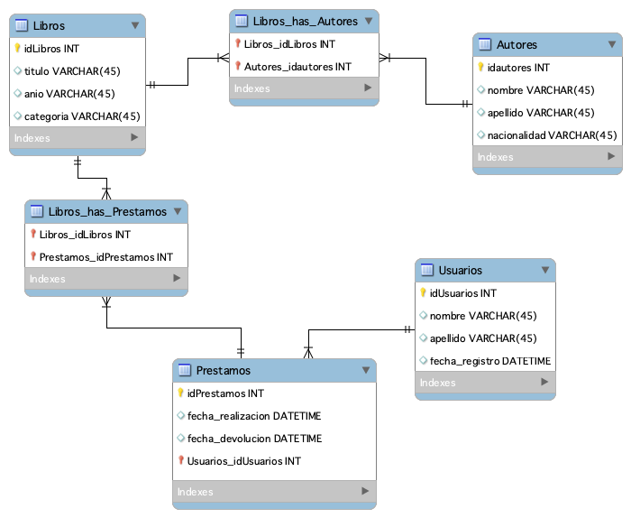

### 1. Diseño de una base de datos

Aquí os dejamos una posible solución del diseño de la bases de datos. 

### 2. Normalización de tablas (BONUS)

- Tabla original

| id_alumna | nombre | dirección | id_asignatura | asignatura | nota |
|---------- |------- |---------- |-------------- |----------- |----- |
| 1 | Cristina Marín | Cuenca, España | 101 | Bases de datos  | 8 |
| 1 | Cristina Marín | Cuenca, España | 102 | Extracción      | 9 |
| 1 | Cristina Marín | Cuenca, España | 103 | Limpieza        | 8 |
| 2 | Marta López    | Toledo, España | 101 | Bases de datos  | 7 |
| 2 | Marta López    | Toledo, España | 103 | Limpieza        | 9 |
| 3 | Rocío Pérez    | Nantes, Francia | 101 | Bases de datos | 10|
| 3 | Rocío Pérez    | Nantes, Francia | 102 | Extracción     | 7 |
| 4 | Elena Rodriguez| Monterrey, México | 101 | Bases de datos | 10|
| 4 | Elena Rodriguez| Monterrey, México | 102 | Extracción     | 9 |
| 4 | Elena Rodriguez| Monterrey, México | 103 | Limpieza       | 7 |

- Separamos los datos de las columnas nombre y dirección

| id_alumna | nombre | apellido | ciudad | país | id_asignatura | asignatura | nota |
|---------- |------- |---------- |-------------- |----------- |----- |----------- |----- |
| 1 | Cristina| Marín | Cuenca| España | 101 | Bases de datos  | 8 |
| 1 | Cristina | Marín | Cuenca| España | 102 | Extracción      | 9 |
| 1 | Cristina | Marín | Cuenca| España | 103 | Limpieza        | 8 |
| 2 | Marta | López    | Toledo| España | 101 | Bases de datos  | 7 |
| 2 | Marta | López    | Toledo| España | 103 | Limpieza        | 9 |
| 3 | Rocío | Pérez    | Nantes| Francia | 101 | Bases de datos | 10|
| 3 | Rocío | Pérez    | Nantes| Francia | 102 | Extracción     | 7 |
| 4 | Elena | Rodriguez| Monterrey| México | 101 | Bases de datos | 10|
| 4 | Elena | Rodriguez| Monterrey| México | 102 | Extracción     | 9 |
| 4 | Elena | Rodriguez| Monterrey| México | 103 | Limpieza       | 7 |

- Creamos dos tablas diferentes para alumnas y asignaturas con sus PK:

| id_alumna(PK) | nombre | apellido | ciudad | país 
|---------- |------- |---------- |-------------- |----------- 
| 1 | Cristina | Marín | Cuenca| España | 
| 2 | Marta | López    | Toledo| España |  
| 3 | Rocío | Pérez    | Nantes| Francia |  
| 4 | Elena | Rodriguez| Monterrey| México | 

| id_asignatura(PK) | asignatura 
|---------- |------- |
| 101 | Bases de datos  
| 102 | Extracción      
| 103 | Limpieza 

- Creamos una tabla intermedia con PK compuesta y las notas para no perder información:

| id_alumna(pk) | id_asignatura (pk) | nota
|---------- |------- |------- |
| 1 | 101  | 8
| 1 | 102  | 9  
| 1 | 103  |8
| 2 | 101  |7
| 2 | 103  |9
| 3 | 101  |10
| 3 | 102  |7
| 4 | 101  |10
| 4 | 102  |9
| 4 | 103  |7
       